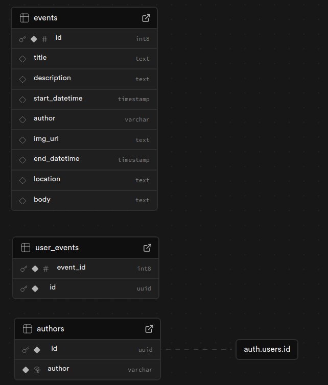

# EventLite

## Live Site

Please find the hosted site [here:](https://eventlite.koo.codes/)

```
https://eventlite.koo.codes/
```

## Summary

EventLite is an events sharing/signup site for a local business, allowing users to signup to events and add them to their google calendars and admins to create and edit events.

## Test Accounts

The password for all test accounts is:

```
test123
```

Users:

```
testuser@test.com
testuser2@test.com

```

Admins:

```
testadmin@test.com
testadmin2@test.com

```

You are also welcome to create your own account to test, but note that it will only be granted user privileges and so, only able to sign up and add events to calendar.

This is also limited to a small quota of signups due to using a free tier SMTP service, so sometimes signup is unavailable.

## Installation / How to run

### Prerequisites

- Node v22.4.1 or above

### Installation

Clone this repo in your desired directory via:
`git clone https://github.com/Roodbaraky/events-platform`

Install necessary dependencies via:
``npm install` or use your preferred dependency manager e.g. _bun_

### Setup

To run this project with your own database you will need to create a Supabase project with events, user_events, and authors tables OR adapt the code to use an alternative database client, in place of the Supabase client. Please refer to the schema for table structure:


This application makes use of Postgres database functions, namely _"get_user_events"_ which you can find the SQL for in _./config_ and uses the Supabase client to invoke them - you may need to make further adaptations to invoke these if using an alternative client.

You will need to create a _.env_ file in the project root directory, populating the following variables and/or suitable alternatives if you choose to use an alternative means of database management.

```
VITE_PASSWORD=
VITE_SUPABASE_URL=
VITE_SUPABASE_ANON_KEY=
VITE_GOOGLE_CLIENT_ID=
```

### Development

To run the development server, use the command:
`npm run dev` or `npm run dev -- --host` to expose the dev site to other devices on your network e.g. mobile, you will find respective addresses for this in the console e.g.:

```
  ➜  Local:   http://localhost:5173/
  ➜  Network: http://192.168.0.168:5173/
  ➜  Network: http://172.18.0.1:5173/
  ➜  Network: http://172.19.0.1:5173/
  ➜  Network: http://172.17.0.1:5173/
```

Visiting any of the above addresses in the browser will take you to the site instance running in development mode.

### Functionality

Visitors are able to browse events freely from the Events page, viewing all relevant info etc.

Users must be logged in to an existing account / create an account in order to sign up for an event. Once signed up, users can click "add to calendar" to add an event to their Google calendar, autopopulating with the event details. Similarly, users can unsubscribe from events as they please.
Users can view events they have signed up for on the _My Page_ page, for convenience.

Admins are able to create new events via "Create Event" in the navigation bar, these can be edited at any time.

User authentication is handled via Supabase Auth which uses JWTs in localStorage, valid for 1 hour before refreshing tokens, in line with Supabase's security guidance.

Navigation to pages which require a user/admin to be logged in will prompt the visitor to sign in, if navigated to via the GUI. Attempts to navigate to said pages via URL result in a redirect / error page.
